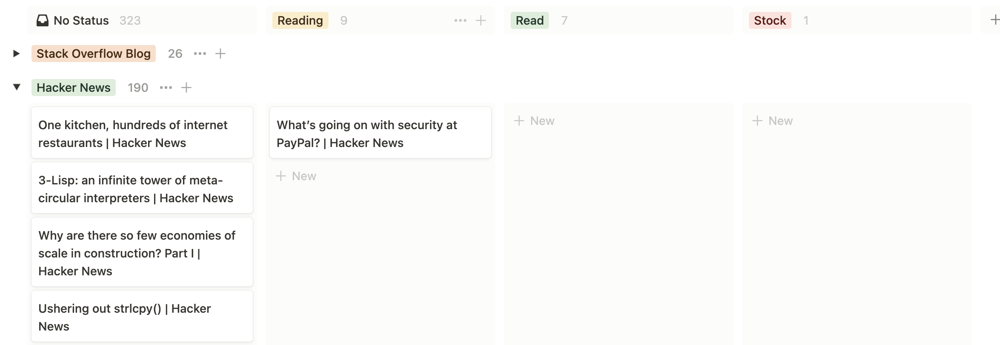

# rss-in-notion

🔖 RSS meets Notion written in Go



## Setup

Please fork the repository if you want to feed pages by your favorite urls. Then setup configuration.

### Notion

You need to prepare Notion Database then set properties.

| Property Name | Property Type | Comment                           |
| :------------ | :------------ | :-------------------------------- |
| Name          | Title         | Article title                     |
| URL           | URL           | Article url                       |
| Publish       | Date          | Article published datetime        |
| Created       | Created time  | Notion Page created datetime      |
| Tags          | Multi-select  |                                   |
| Status        | Select        | one of "Reading", "Read", "Stock" |

#### Environment

- NOTION_TOKEN
- NOTION_DATABASE_ID

If you want to run this task on GitHub Actions, set these environment in settings page. And then, please configure your yaml files placed in .github/workflows like this below.

```
on:
  workflow_dispatch:
  schedule:
    - cron: 0 4 * * *
  push:
    branches:
      - main
```

## Author

Shintaro Kaneko
